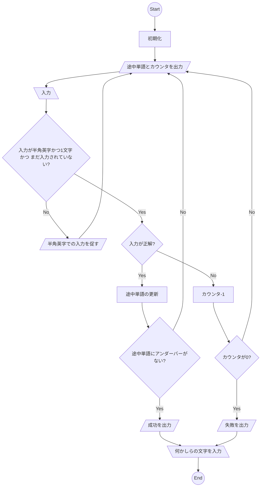

# 設計メモ
## モデル
フローチャート(ナイーブ、自然言語的)

## 設計の方針
 - 変数や処理はクラスにまとめる
 - クラスに状態を持たせる
    - Playing: 継続
    - Won: 勝利
    - Lost: 敗北
 - 入出力の受け取りと条件分岐はmain関数にまとめる

## 必要なクラス変数
 - counter
    - Integer
    - 残試行回数
 - word
    - String
    - 正解の単語
    - 途中単語は都度作成することにする
 - state
    - String
    - 状態
 - guessed_letters
    - Set
    - ユーザーの入力

## 必要な関数
 - get_display_word(self): string
    - 表示用単語を返す
 - process_guess(self, guess): string or None
    - ユーザーの入力を受取り、状態を更新する
    - 入力バリデーションでエラーの場合、stringを返す
    - その他の場合、エラーを返す
 - get_status(self): string or None
    - stateがWon or Lostなら、現在のゲームの状態に応じたメッセージを返す
    - stateがPlaying なら、Noneを返す

## メモ
- 英語1文字の判定(str.isalpha vs str.encode('utf-8').isalpha())
    - str.isalpha()は、strが複数バイト文字の時、Trueを返す可能性がある
        - 実際の動作で試したが、どういう条件でそうなるのか不明。複数バイト文字を勝手にエンコードして分割し、それがたまたまアルファベットとして判定されるとTrueになるのかな？仕組みがよくわからない
        - https://docs.python.org/ja/3.13/library/stdtypes.html#str.isalpha
    - strをutf-8でエンコードして、bytes.isalpha()でASCII文字判定した方がよい
        - https://docs.python.org/ja/3.13/library/stdtypes.html#str.isalpha

## Todo: スクリプトを前提にフローチャートを書き直す